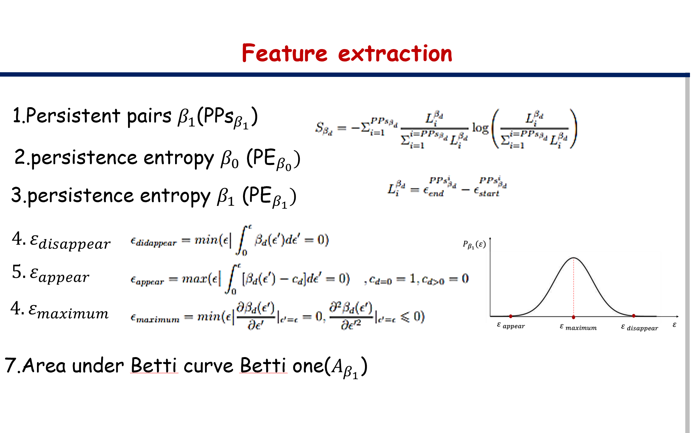
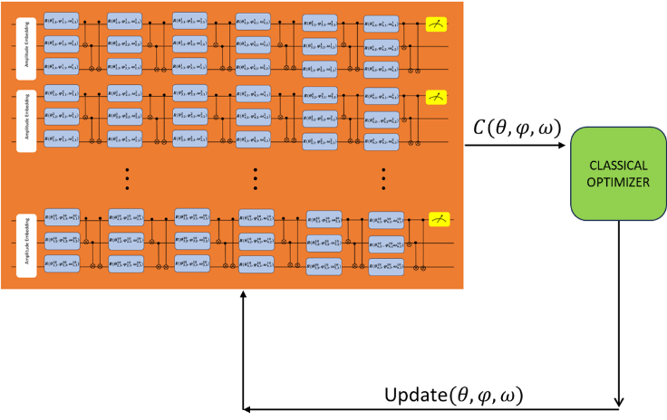

# Quantum Machine Learning for Time Series Classification using Topological Data Analysis

## Overview

This repository contains the materials and code related to my Master’s thesis. My research focuses on exploring **Quantum Machine Learning (QML)** techniques for classifying time series data generated by **fractional Brownian motion (fBm)**. The main contributions of my thesis include:

- Studying quantum circuits and their use in quantum algorithms.
- Implementing quantum algorithms, including **Grover’s algorithm** via quantum circuits to solve problems such as bipartite graph analysis.
- Exploring the field of **Quantum Machine Learning (QML)** and its differences from classical machine learning.
- Applying **Topological Data Analysis (TDA)** techniques for extracting robust features from time series data.
- Designing a quantum classification model for time series classification based on extracted topological features.

---

## Main Work Summary

Matrix algebra, along with the symmetric and anti-symmetric nature of the wave function of multi-particle systems, has led to a new approach alongside classical physics, namely quantum mechanics. Inspired by the proposed approaches in quantum computing and the efforts to build quantum computers, new algorithms for optimization and solving complex problems have been developed.

In this thesis, I leveraged the **self-similarity** property of a global class of time series modeled based on **fractional Brownian motion (fBm)**, which is characterized by the Hurst exponent. My goal was to use **Topological Data Analysis (TDA)** derived from algebraic topology—known for its robustness to noise and trends—in the field of **Quantum Machine Learning (QML)** for classifying fBm time series.

Specifically:

- I generated **200 fractional Brownian motion time series** across ten classes of Hurst exponents, \( H \in [0,1] \) with step size \( \Delta H = 0.1 \).
- 75% of the data was used for training, and 25% for testing.
- From each time series, I extracted **seven topological features** using persistent homology:

  

- These features were embedded into quantum states via a **quantum domain embedding** method.
- I constructed a **six-layer quantum circuit** using rotation gates with trainable parameters and controlled gates to create entanglement. The model (VQC) was designed for multi-class classification across the ten Hurst exponent classes.

  

- The cost function was defined as the square of the expectation value of the Pauli-Z operator, capturing the probabilistic nature of quantum measurements.
- I optimized the quantum model using the **Adam optimizer**.
- The best classification accuracy achieved was **87%**, independent of the values of the Hurst exponent.

---

## Main Topics Covered

### Quantum Circuits

- Qubits and quantum gates
- Single- and multi-qubit operations
- Simulation and modeling of quantum circuits

### Quantum Algorithms

- Deutsch-Jozsa algorithm
- Grover’s search algorithm
- Design and implementation of Grover’s algorithm using quantum circuits to solve the bipartite graph problem

### Quantum Machine Learning

- Fundamentals of QML vs. classical ML
- Quantum neural networks
- Quantum support vector machines (QSVM)
- Parameterized quantum circuits for machine learning applications

### Topological Data Analysis (TDA)

- Persistent homology concepts
- Simplicial complexes and topological features
- Persistence barcodes and Betti numbers
- Extraction of robust features from data

### Time Series Analysis

- Fractional Brownian motion (fBm)
- Hurst exponent and time series modeling
- Classification of fBm time series using QML

---
## Books and Learning Resources

During the research for my thesis, I explored several excellent learning resources and books. I also ran many example codes and tutorials from these references, which greatly helped me understand both theoretical and computational concepts in quantum computing and quantum machine learning.

All books and materials that helped me during my studies are collected in the **/books** folder of this repository, where possible.

### Books

- **Quantum Machine Learning with Python: Using Cirq from Google Research and IBM Qiskit**  
  Santanu Pattanayak

- **Machine Learning with Quantum Computers**  
  Maria Schuld, Francesco Petruccione

- **Hands-On Quantum Machine Learning With Python, Volume 1: Get Started**  
  Dr. Frank Zickert

- **Supervised Learning with Quantum Computers**  
  Maria Schuld, Francesco Petruccione

---

### Useful Links

- [Qiskit Documentation Tutorials](https://qiskit.org/documentation/tutorials.html)
- [Qiskit Summer School 2021](https://qiskit.org/learn/summer-school/quantum-computing-and-quantum-learning-2021)
- [Pennylane AI Documentation](https://docs.pennylane.ai/en/stable/)
- [QWorld Courses](https://gitlab.com/qworld)
- [QNickel (QWorld)](https://gitlab.com/qworld/nickel)
- [QBoronz (QWorld)](https://gitlab.com/qworld/bronze-qiskit)
- [QSilver (QWorld)](https://gitlab.com/qworld/silver)

## Keywords

Quantum machine learning, Quantum optimization, Topological data analysis, Fractional Brownian motion (fBm)

---
## Additional Work and Experiments

In the process of completing this thesis, I also explored and implemented other quantum machine learning concepts and models beyond the main topic. These include:

- Quantum K-means
- Quantum Regression
- Quantum Classification Models
- Quantum KNN
- Extracting TDA features from fBm signals
- Producing fGn and fBm signals

You can find the code and experiments related to these topics in the following folders of this repository, or in my separate repository for side projects:

👉 [qml-lab Repository](https://github.com/NargesEghbali/QML-Lab)

This side repository collects various experiments and models I worked on during my studies, and may serve as inspiration for others interested in quantum machine learning.
## How to Use

- Clone the repository
- Explore the code and datasets
- Check out the slides and thesis documents for deeper understanding
